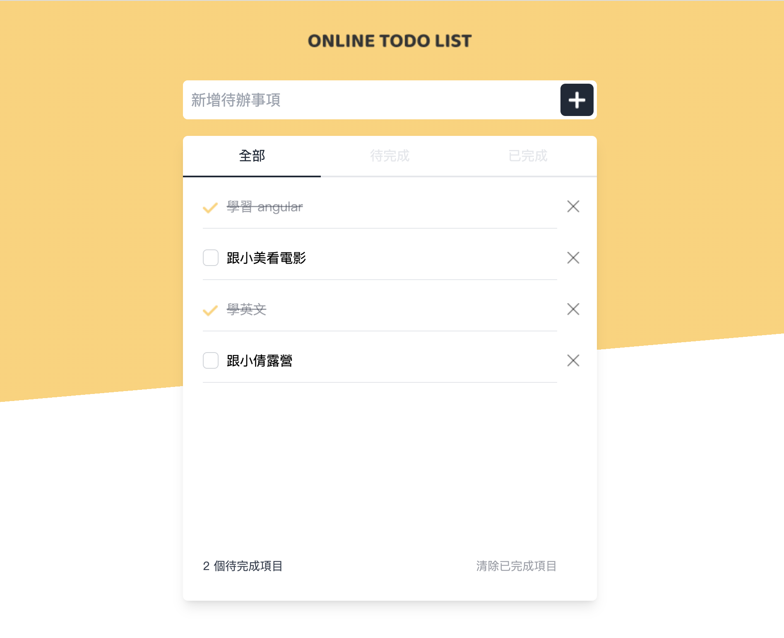
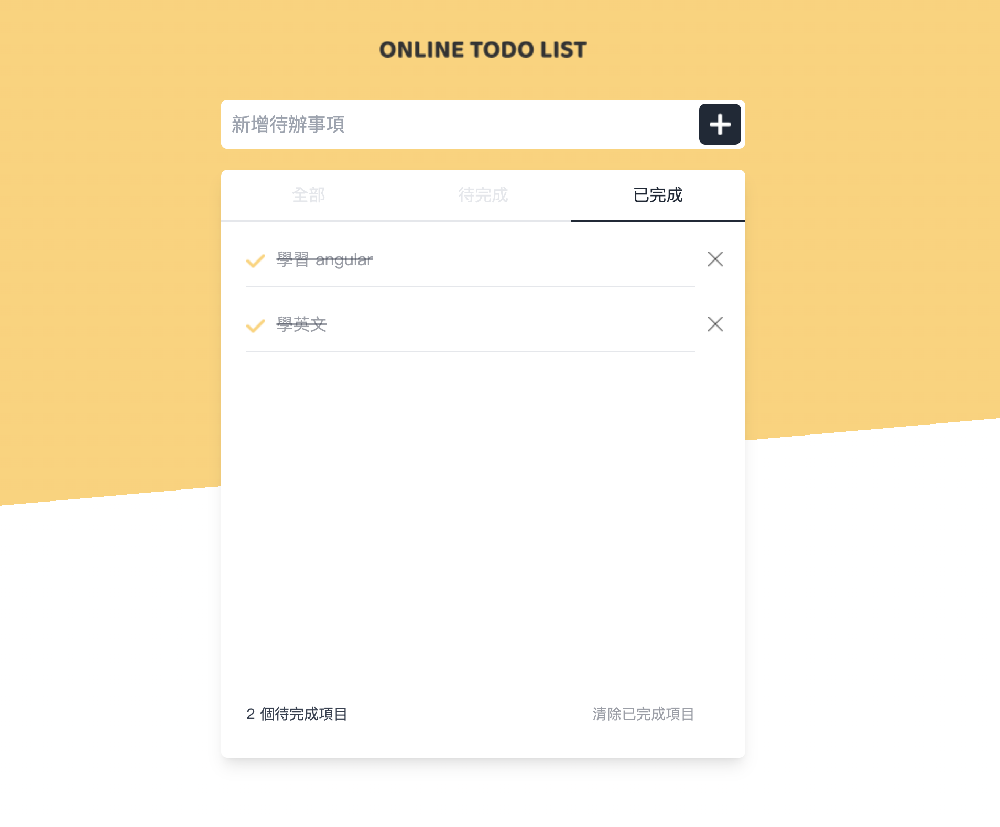
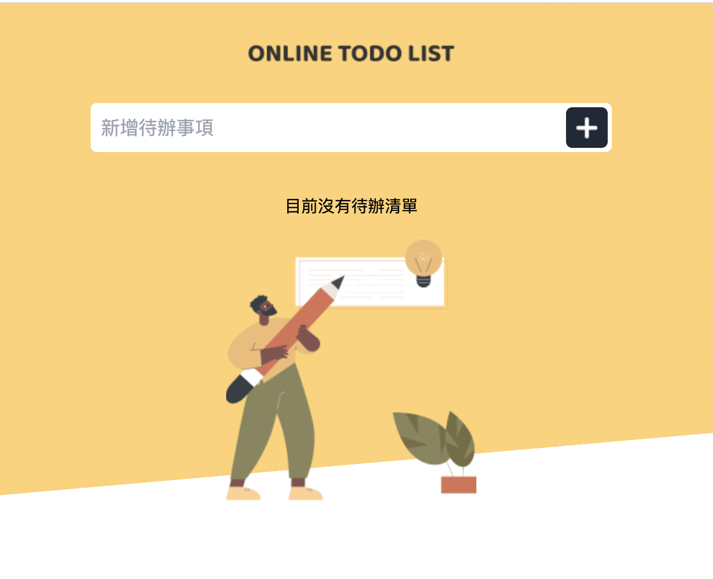

# Ng Todo List

- 顯示全部

- 顯示已完成

- 目前沒有任何資料
## Development server

Run `ng serve` for a dev server. Navigate to `http://localhost:4200/`. The application will automatically reload if you change any of the source files.

